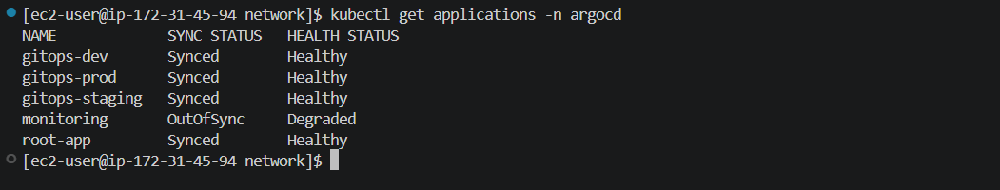
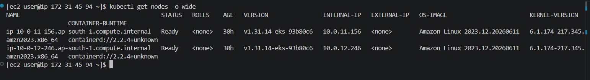
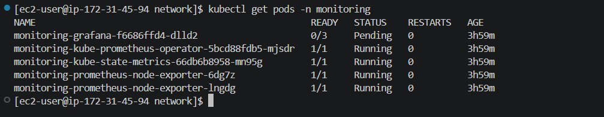
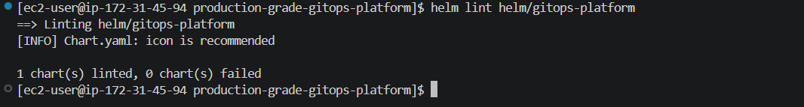
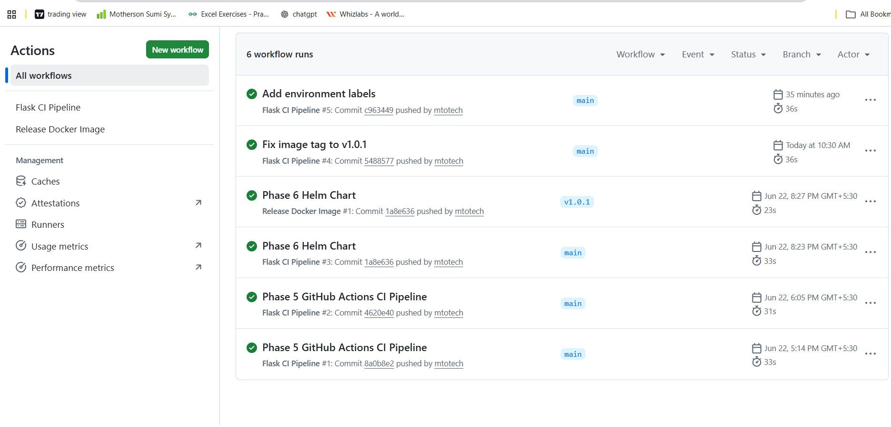
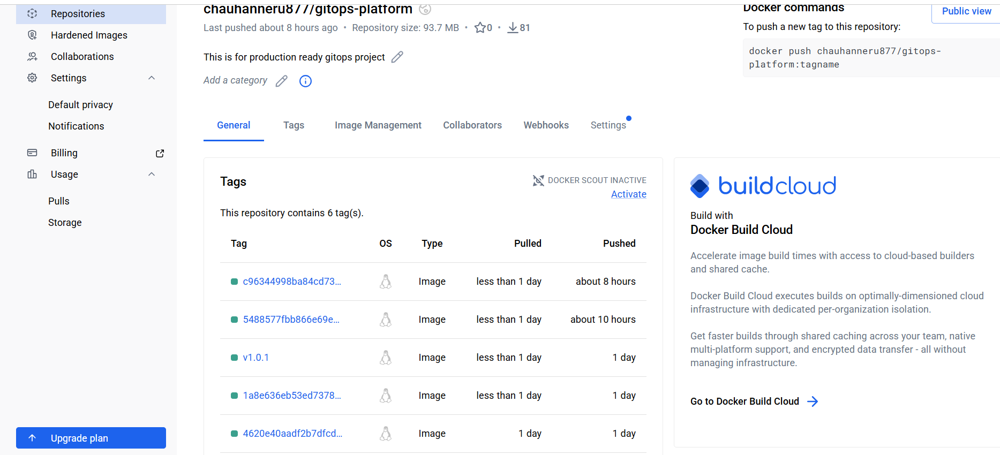
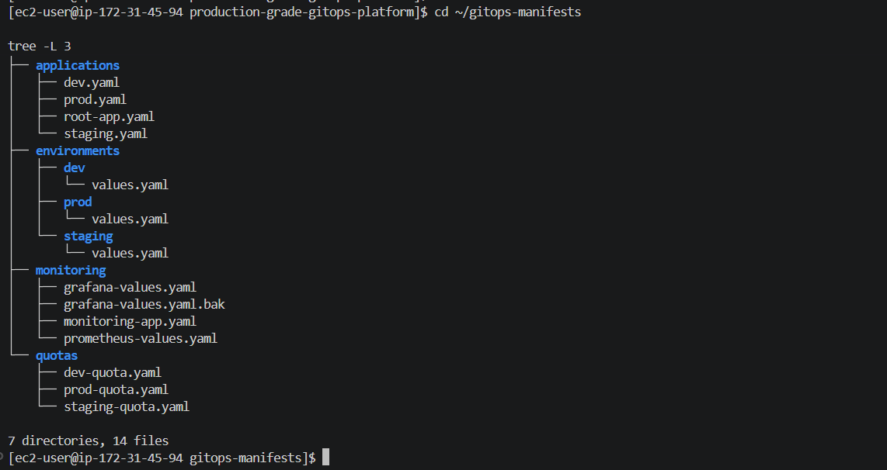

## Production Grade GitOps Platform on AWS EKS
#### AWS Terraform Docker Kubernetes Helm ArgoCD GitHub Actions
________________________________________
#### Overview
##### Production Grade GitOps Platform built on AWS EKS using Terraform, Docker, Helm, ArgoCD, GitHub Actions and Kubernetes.
##### The project demonstrates a complete DevOps workflow from infrastructure provisioning to application deployment using GitOps principles.
________________________________________
#### Architecture
Developer

     │
    ▼
    
GitHub Repository

    │
    ▼
    
GitHub Actions

    │
    ▼
    
DockerHub

     │
    ▼
GitOps Repository

    │
    ▼

ArgoCD

    │
    ▼
Amazon EKS

    │
    
 ┌──┼─────────────┐
 
 ▼  ▼             ▼

Dev    Staging      Prod
________________________________________
### Technology Stack
#### Cloud
•	AWS EKS

•	VPC

•	IAM

•	EC2

•	EBS

#### Infrastructure as Code
•	Terraform

Containers

•	Docker

•	DockerHub

#### Kubernetes
•	EKS

•	Deployments

•	Services

•	Namespaces

•	Resource Quotas

#### GitOps

•	ArgoCD

•	App of Apps Pattern

#### CI/CD

•	GitHub Actions

#### Monitoring
•	Prometheus Operator

•	Node Exporter

•	kube-state-metrics
________________________________________
### Project Repositories
### Application Repository
#### production-grade-gitops-platform

##### Contains:
•	Flask Application

•	Dockerfile

•	Helm Chart

•	GitHub Actions Workflow
### GitOps Repository
#### gitops-manifests

Contains:

•	ArgoCD Applications

•	Environment Configuration

•	Monitoring Configuration

•	Resource Quotas
________________________________________
### Completed Phases
#### Completed Phases
#### Phase 1 – Terraform Backend
Completed

Implemented:

•	Remote State

•	Terraform Structure

•	State Management

Status: COMPLETE
________________________________________
#### Phase 2 – AWS Networking
Completed

Implemented:

•	VPC

•	Internet Gateway

•	NAT Gateway

•	Public Subnets

•	Private Subnets

•	Route Tables

Status: COMPLETE
________________________________________
#### Phase 3 – EKS Cluster
Completed

Implemented:

•	Amazon EKS

•	Managed Node Groups

•	IAM Roles

•	Cluster Access

Status: COMPLETE
________________________________________
#### Phase 4 – Application Containerization
Completed

Implemented:

•	Flask Application

•	Dockerfile

•	DockerHub Repository

Status: COMPLETE
________________________________________
##### Phase 5 – Helm Packaging
Completed

Implemented:

•	Helm Chart

•	ConfigMaps

•	Secrets

•	Deployments

•	Services

Status: COMPLETE
________________________________________
#### Phase 6 – GitHub Actions CI/CD
Completed
Implemented:

•	Docker Build

•	Docker Push

•	Automated Pipeline

Status: COMPLETE
________________________________________
#### Phase 7 – ArgoCD GitOps
Completed

Implemented:

•	ArgoCD Installation

•	Root Application

•	App of Apps Pattern

•	GitOps Workflow

Status: COMPLETE
________________________________________
#### Phase 8 – Multi Environment Deployment
Completed

Namespaces:

•	dev

•	staging

•	prod

Implemented:

•	Environment Specific Values

•	Resource Isolation

•	Resource Quotas

Status: COMPLETE
________________________________________
#### Phase 9 – Monitoring Foundation
Implemented

Components:

•	Prometheus Operator

•	Node Exporter

•	kube-state-metrics

•	Monitoring Namespace

•	GitOps Deployment

Current Status:
•	Monitoring Stack Partially Operational
•	Grafana Persistence Pending Validation

Status: SUBSTANTIALLY COMPLETE

________________________________________
#### Multi Environment Strategy
Namespaces:

•	dev

•	staging

•	prod

##### Benefits:
•	Environment Isolation

•	Resource Governance

•	Controlled Promotion Strategy
________________________________________
#### Monitoring Stack
Implemented Components:

•	Prometheus Operator

•	Node Exporter

•	kube-state-metrics

#### Metrics:
•	CPU Usage

•	Memory Usage

•	Node Health

•	Pod Health

•	Cluster Metrics
________________________________________
#### Screenshots
ArgoCD Applications

EKS Nodes

Monitoring Stack

Helm-lint

GitHub_Pipeline

DockerHub_repository

repository-structure-gitops

________________________________________
Deployment
Refer:
docs/DEPLOYMENT-GUIDE.md
________________________________________
Destroy Infrastructure
Refer:
docs/DESTROY-GUIDE.md
________________________________________
### Author
Neeraj Kumar

AWS Certified Solutions Architect Associate

HashiCorp Certified Terraform Associate

Cloud & DevOps Engineer
